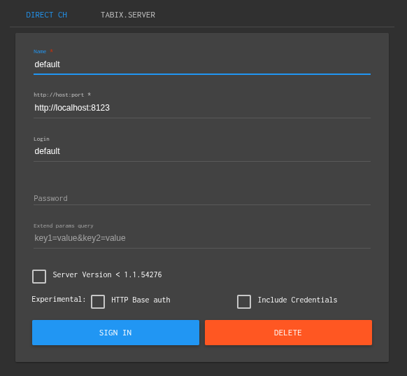
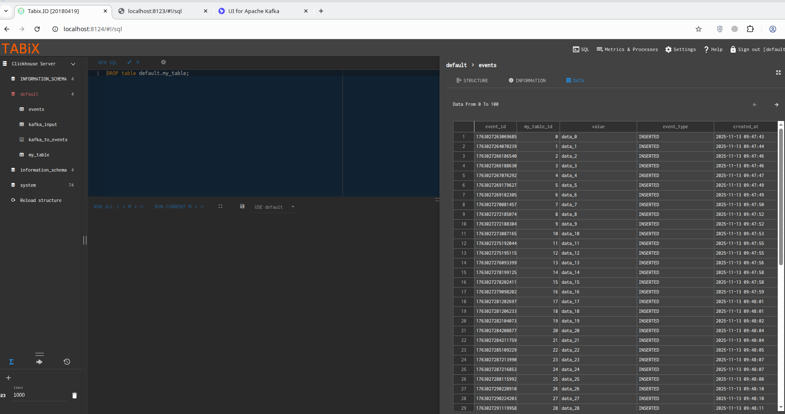

# ClickHouse + Kafka

Этот проект демонстрирует интеграцию Kafka с ClickHouse, включая автоматическую генерацию событий и хранение данных.

Сообщения приходят в Kafka, затем потребляются и сохраняются в основной таблице my_table, одновременно создаются события в таблице events.

## Структура проекта
Producer  → Kafka (topic=events) → Consumer 1 → Kafka (topic=events) → ClickHouse Kafka Engine (kafka_input)
→ Materialized View → MergeTree (events) → Consumer 2 (поймаем из событий ClickHouse)


- **producer** – Go-продюсер, который отправляет JSON-сообщения в Kafka-топик `data_topic`.
- **consumer** – Go-приложение, которое:
  1. Создаёт необходимые таблицы ClickHouse.
  2. Подключается к Kafka-топику и читает сообщения.
  3. Вставляет данные в `my_table`.
  4. Создаёт запись в `events` для каждого вставленного объекта.
  5. Materialized View `kafka_to_events` автоматически переносит данные из таблицы Kafka Engine `kafka_input` в `events`.


## Сборка и запуск контейнеров
Сборка
```bash
docker compose up --build
```
Запуск
```bash
docker compose up -d
```


## Запуск консумера
```bash
docker exec -it clickhouse-kafka-consumer1-1 sh
```
В контейнере
```bash
./consumer
```

## Запуск продюсера
```bash
docker exec -it clickhouse-kafka-producer-1 sh
```
В контейнере
```bash
./producer
```

## Подключение tabix к clickhouse
http://localhost:8124


## UI для Apache Kafka
http://localhost:8080/


## Созданные таблицы

### 1. `my_table`  

Основная таблица для хранения объектов из Kafka:

```sql
CREATE TABLE IF NOT EXISTS default.my_table
(
    id UInt64,
    value String
)
ENGINE = MergeTree()
ORDER BY id;
```
- id — уникальный идентификатор объекта.

- value — строковое значение/payload.

### 2. kafka_input

Kafka Engine — “труба” между Kafka и ClickHouse:
```SQL
CREATE TABLE IF NOT EXISTS default.kafka_input
(
    id UInt64,
    value String
)
ENGINE = Kafka
SETTINGS
    kafka_broker_list = 'kafka:9093',
    kafka_topic_list = 'data_topic',
    kafka_group_name = 'ch_group',
    kafka_format = 'JSONEachRow',
    kafka_num_consumers = 1;

```

### 3. events
Журнал событий, связанных с объектами из my_table:
```SQL
CREATE TABLE IF NOT EXISTS default.events
(
    event_id UInt64,
    my_table_id UInt64,
    value String,
    event_type String,
    created_at DateTime DEFAULT now()
)
ENGINE = MergeTree()
ORDER BY event_id;
```
- event_id — уникальный идентификатор события.
- my_table_id — ссылка на объект из my_table.
- value — значение из my_table.
- event_type — тип события (INSERTED, INSERTED_FROM_KAFKA).
- created_at — время создания события.

## Пример переданных данных в Clickhouse
http://localhost:8124

